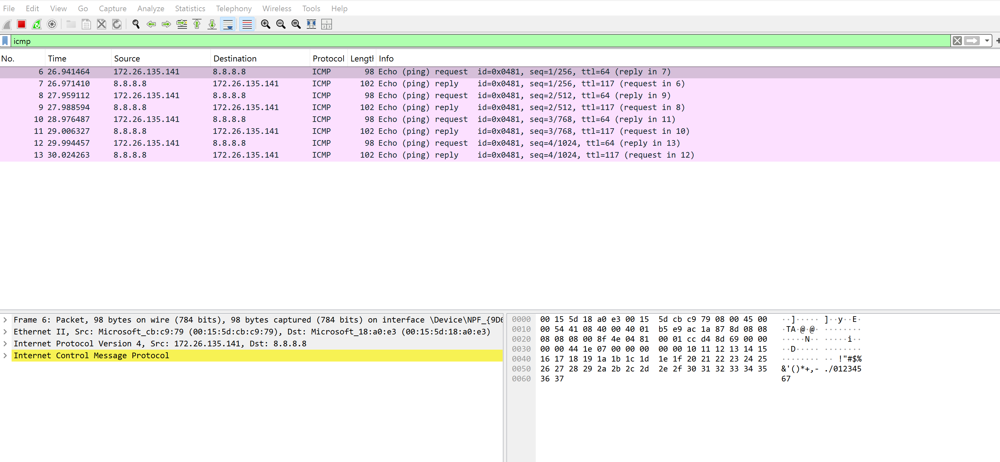
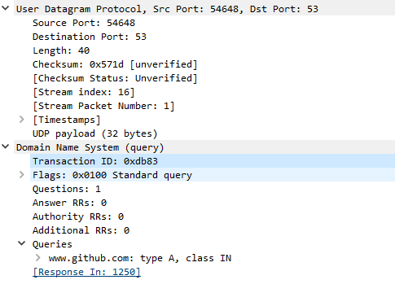
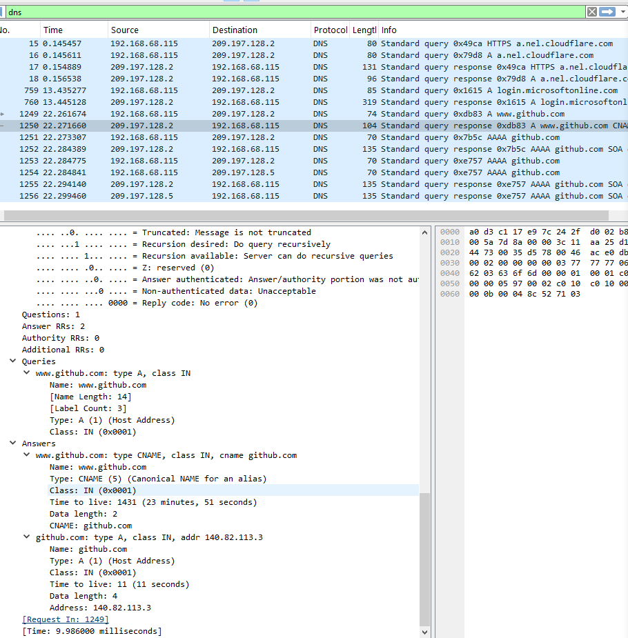

# Laboratoire 2 - Introduction aux Réseaux
## Systèmes d'exploitation - Collège de Maisonneuve

---

**Nom :** zamzam fatima

**Nom :** unaiza ali bhaiti

**Groupe :** 

**Lien GitHub du devoir** : _____________________

**Date de remise :** vendredi 13 février 2026
---

## Barème récapitulatif

| Section | Points | Note |
|---------|--------|------|
| Partie 1 : Questions théoriques | 20 | /20 |
| Partie 2 : Commandes réseau | 25 | /25 |
| Partie 3 : Analyse Wireshark | 25 | /25 |
| Partie 4 : Script Bash | 30 | /30 |
| **TOTAL** | **100** | **/100** |

---

# Partie 1 : Questions théoriques (20 points)

## Question 1 - Modèle OSI (5 points)

### a) Complétez le tableau (2.5 pts)

| Protocole/Élément | N° Couche | Nom de la couche |
|-------------------|-----------|------------------|
| HTTP | 7 | application |
| Adresse IP | 3 | Réseaux |
| Câble Ethernet |1 | Physique |
| TCP | 4 | transport |
| Adresse MAC |2 | liaison de donnée |

### b) Différence entre le modèle OSI et TCP/IP (2.5 pts)

```
Votre réponse : 
le modele osi est modele theorique contient 7 couches par contre le modele TCP IP regroupe certaines couches pour simplifier l'implémentation , alors il contient 4 couches 


```

---

## Question 2 - Adresses IP (5 points)

### a) Adresses privées ou publiques (2.5 pts)

| Adresse IP | Privée / Publique |
|------------|-------------------|
| 192.168.1.50 |privée |
| 8.8.8.8 |Public |
| 10.0.0.1 |privée |
| 172.20.5.100 | privée|
| 200.100.50.25 |Public |

### b) Qu'est-ce qu'un masque de sous-réseau ? À quoi sert-il ? (2.5 pts)

```
Votre réponse :
le masque de sous réseaux separe la partie réseaux et la partie hote de l'adresse IP , on peut savoir les appariels qui sont dans le meme resaux


```

---

## Question 3 - Protocoles (10 points)

### a) Expliquez le fonctionnement du protocole ARP. Pourquoi est-il nécessaire ? (3 pts)

```
Votre réponse : ARP traduit une adresse IP en adresse MAC sur un reseau local , 
cette etape est nécessaire car la communication ethernet utilise les adresses MAC


```

### b) Différence entre une requête DNS de type A et de type AAAA ? (2 pts)

```
Votre réponse :
dns A asocie un nom de domaine a l'ancienne version des adresse IP (IPv4)
alors que dns AAAA associe un nom a une adresse avec la vesrsion moderne (IPv6)


```

### c) Expliquez ce que fait la commande `ping` au niveau du protocole ICMP. Quels types de messages sont échangés ? (3 pts)

```
Votre réponse :
ping utilise ICMP pour une envoyer une demande echo request (type8) et echo reply(type0) pour la confirmation 
alors ca verifier la connexion reseua et connaitre le temps de réponse


```

### d) Sur quel port et avec quel protocole de transport fonctionne DNS par défaut ? Pourquoi ce choix ? (2 pts)

```
Votre réponse : dns fonctionne par defaut avec port 53 avec le protocole UDP parce que udp est rapide et leger il ne neccessite pas la connexion


```

---

# Partie 2 : Commandes réseau (25 points)

## Exercice 1 : Configuration réseau (10 points)

### a) Configuration réseau

**Commande utilisée :**
```bash
ip addr
```

**Adresse IP :**
```
172.26.135.141
```

**Masque de sous-réseau :**
```
/20
```

**Nom de l'interface réseau principale :**
```
eth0
```

### b) Passerelle par défaut

**Commande utilisée :**
```bash
ip route

```

**Adresse de la passerelle :**
```
172.26.128.1
```

### c) Serveurs DNS

**Commande utilisée :**
```bash
cat /etc/resolv.conf
```

**Serveurs DNS configurés :**
```
10.255.255.254
```

> 📸 **Capture d'écran 1** : Insérez votre capture montrant la configuration réseau
> 
>

---

## Exercice 2 : Tests de connectivité avec ping (8 points)

### a) Ping vers localhost (127.0.0.1) - 4 paquets

**Commande exacte utilisée :**
```bash
ping -c 4 127.0.0.1

```

**Résultat (succès/échec) :**
```
Succes
```

**Temps moyen de réponse :**
```
0.039ms
```

### b) Ping vers la passerelle - 4 paquets

**Résultat (succès/échec) :**
```
Echec
```

**Temps moyen de réponse :**
```
il n'y a pas de emps moyen vue que ca a echouer mais le temps totale est de 3006 ms.
```

### c) Ping vers 8.8.8.8 - 4 paquets

**Résultat (succès/échec) :**
```
Succes
```

**Temps moyen de réponse :**
```
11.206ms
```

### d) Si le ping vers 8.8.8.8 fonctionne mais pas vers google.com, quel serait le problème probable ?

```
Votre réponse :
Le probleme probable est un probleme de DNS. L'internet fonctionne mais le DNS ne fonctionne pas bien donc il peux pas traduire/trouver l'adresse IP du nom google.com.
```

> 📸 **Capture d'écran 2** : Insérez votre capture des tests ping
> 

---

## Exercice 3 : Table ARP et résolution DNS (7 points)

### a) Table ARP

**Commande utilisée :**
```bash
arp -a
```

**Nombre d'entrées :**
```bash
Une entrée


```
**Une entrée (IP et MAC) :**`
```
172.21.32.1    00:15:5d:c0:49:b0
```
### b) Requête DNS pour www.collegemaisonneuve.qc.ca

**Commande utilisée :**
```bash
nslookup www.cmaisonneuve.qc.ca
```

**Adresse IP obtenue :**
```
151.101.126.132
```

### c) Commande `dig` pour github.com - TTL

**TTL (Time To Live) de l'enregistrement :**
```
TTL est 0ms mais le temps de la requete est de 13ms.
```

> 📸 **Capture d'écran 3** : Insérez votre capture de la table ARP et d'une requête DNS
> 
---

# Partie 3 : Analyse Wireshark (25 points)

## Exercice 4 : Capture et analyse ICMP (10 points)

### Analyse d'un paquet "Echo (ping) request"

| Information | Valeur observée |
|-------------|-----------------|
| Adresse MAC source |00:15:5d:cb:c9:79 |
| Adresse MAC destination |00:15:5d:18:a0:e3 |
| Adresse IP source |172.26.135.141 |
| Adresse IP destination |8.8.8.8 |
| Type ICMP (numéro) |8 |
| Code ICMP |0 |

### Question : Différence entre le Type ICMP d'un "Echo Request" et d'un "Echo Reply" ?

```
Votre réponse :
echo request est envoyé pour tester la connexion
echo reply est la réponse envoyée par le serveur cible

```

> 📸 **Capture d'écran 4** : Capture Wireshark montrant les paquets ICMP avec le détail d'un paquet
> 
> 

---

## Exercice 5 : Capture et analyse DNS (8 points)

### Analyse de la requête et réponse DNS

| Information | Valeur observée |
|-------------|-----------------|
| Port source (requête) |  54648 |
| Port destination (requête) | 53 |
| Protocole de transport | UDP |
| Type de requête DNS | Standard Query Type A |
| Adresse IP dans la réponse | 140.82.113.3 |

> 📸 **Capture d'écran 5** : Capture Wireshark montrant la requête et réponse DNS
> 
> 
> 

---

## Exercice 6 : Capture et analyse ARP (7 points)

### Tableau d'un échange ARP observé

| Information | ARP Request | ARP Reply |
|-------------|-------------|-----------|
| Adresse MAC source | | |
| Adresse MAC destination | | |
| Adresse IP recherchée | | |

### Question : Pourquoi l'adresse MAC de destination dans l'ARP Request est-elle `ff:ff:ff:ff:ff:ff` ?

```
Votre réponse :


```

> 📸 **Capture d'écran 6** : Capture Wireshark montrant l'échange ARP
> 
> 

---

# Partie 4 : Script de diagnostic réseau (30 points)

## Exercice 7 : Création du script

### Informations sur votre script

**Nom du fichier :** `diagnostic_reseau.sh`

### Checklist des fonctionnalités implémentées

Cochez les fonctionnalités que vous avez implémentées :

- [ ] Affichage du nom de l'hôte
- [ ] Affichage de la date et heure
- [ ] Affichage de la version du système
- [ ] Affichage de l'adresse IP locale
- [ ] Affichage de l'adresse de la passerelle
- [ ] Affichage des serveurs DNS
- [ ] Test de connectivité localhost
- [ ] Test de connectivité passerelle
- [ ] Test de connectivité Internet (8.8.8.8)
- [ ] Test de résolution DNS (google.com)
- [ ] Affichage de la table ARP
- [ ] Résolution DNS de 2+ domaines
- [ ] Gestion des erreurs (messages si échec)
- [ ] Commentaires dans le code
- [ ] Affichage clair avec titres de sections

### Difficultés rencontrées (optionnel)

```
Décrivez ici les difficultés que vous avez rencontrées lors de la création du script :


```

> 📸 **Capture d'écran 7** : Capture montrant l'exécution de votre script
> 
> 

---

# Récapitulatif de la remise

## Fichiers à inclure dans votre projet

Vérifiez que votre projet contient :

- [ ] `reponse.md` (ce fichier complété)
- [ ] `diagnostic_reseau.sh` (votre script)
- [ ] `captures/capture1_config_reseau.png`
- [ ] `captures/capture2_ping.png`
- [ ] `captures/capture3_arp_dns.png`
- [ ] `captures/capture4_wireshark_icmp.png`
- [ ] `captures/capture5_wireshark_dns.png`
- [ ] `captures/capture6_wireshark_arp.png`
- [ ] `captures/capture7_script_execution.png`

---


---

*Bon travail !*